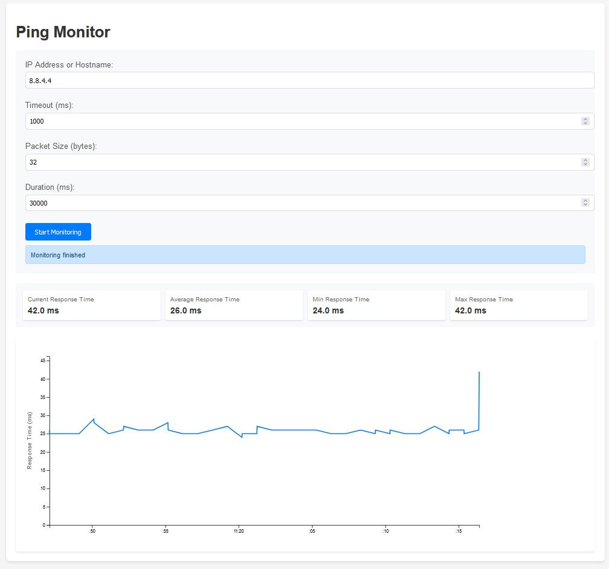

# Ping Monitor

A real-time network monitoring tool built with Node.js that allows you to track and visualize ping response times for any IP address or hostname. The application provides a clean web interface with real-time graphs and statistics.



## Features

- Real-time ping monitoring with configurable parameters
- Interactive D3.js visualization of response times
- Live statistics (min, max, average response times)
- Configurable timeout, packet size, and duration
- Historical data storage using SQLite
- Cross-platform support (Windows, Linux, macOS)
- WebSocket-based real-time updates
- Responsive web interface
- Error handling and status notifications

## Prerequisites

- Node.js (v14.0.0 or higher)
- npm (v6.0.0 or higher)
- ICMP ping permissions on your system

## Installation

1. Clone the repository:
```bash
git clone https://github.com/yourusername/ping-monitor.git
cd ping-monitor
```

2. Install dependencies:
```bash
npm install
```

3. Create required directories:
```bash
mkdir -p logs data public
```

4. Start the application:
```bash
npm start
```

The application will be available at `http://localhost:3000`

## Project Structure

```
ping-monitor/
├── src/
│   ├── config/
│   │   └── config.js         # Application configuration
│   ├── db/
│   │   └── database.js       # Database setup and management
│   ├── services/
│   │   └── pingService.js    # Core ping functionality
│   ├── routes/
│   │   └── pingRoutes.js     # API routes
│   ├── validators/
│   │   └── pingValidator.js  # Input validation
│   ├── middleware/
│   │   └── errorHandler.js   # Error handling middleware
│   ├── utils/
│   │   └── logger.js         # Logging utility
│   ├── websocket/
│   │   └── wsHandler.js      # WebSocket management
│   └── app.js               # Main application file
├── public/
│   └── index.html           # Frontend interface
├── logs/                    # Application logs
├── data/                    # SQLite database
├── package.json
└── README.md
```

## Configuration

The application can be configured through environment variables or the `config.js` file:

```javascript
{
    port: process.env.PORT || 3000,
    dbPath: path.join(__dirname, '../data/ping_monitor.db'),
    logConfig: {
        level: process.env.LOG_LEVEL || 'info',
        // ... other logging options
    },
    ping: {
        minTimeout: 100,
        maxTimeout: 5000,
        minPacketSize: 32,
        maxPacketSize: 65507,
        minDuration: 1000,
        maxDuration: 3600000
    }
}
```

## Usage

1. Open your browser and navigate to `http://localhost:3000`

2. Enter the target host details:
   - IP Address or Hostname (e.g., "8.8.8.8" or "google.com")
   - Timeout (in milliseconds)
   - Packet Size (in bytes)
   - Duration (in milliseconds)

3. Click "Start Monitoring" to begin ping measurements

### API Endpoints

The application provides the following REST API endpoints:

```bash
# Start monitoring a host
POST /api/ping/start
{
    "ip": "8.8.8.8",
    "timeout": 1000,
    "packetSize": 32,
    "duration": 60000
}

# Get historical data
GET /api/ping/history
```

## Development

To run the application in development mode with automatic restart:

```bash
npm run dev
```

### Running Tests

```bash
npm test
```

## Troubleshooting

### Common Issues

1. **Permission Denied**
   - Ensure you have permissions to execute ping commands
   - On Linux/Unix, you might need to run with sudo or set capabilities

2. **Database Errors**
   - Check if the data directory exists and is writable
   - Verify SQLite installation

3. **Connection Timeouts**
   - Verify network connectivity
   - Check firewall settings
   - Ensure ICMP traffic is allowed

### Logs

Logs are stored in the `logs` directory:
- `error.log`: Error messages
- `combined.log`: All application logs

## Contributing

1. Fork the repository
2. Create your feature branch (`git checkout -b feature/AmazingFeature`)
3. Commit your changes (`git commit -m 'Add some AmazingFeature'`)
4. Push to the branch (`git push origin feature/AmazingFeature`)
5. Open a Pull Request

## License

This project is licensed under the MIT License - see the LICENSE file for details.

## Acknowledgments

- D3.js for visualization
- SQLite for data storage
- Express.js for the web server
- WebSocket for real-time communication

## Author

Your Name
- GitHub: [@yourusername](https://github.com/yourusername)
- Email: your.email@example.com

## Support

For support, email your.email@example.com or create an issue in the GitHub repository.